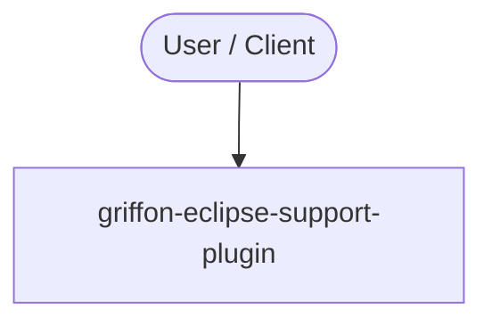

# Context Map — `griffon-eclipse-support-plugin`

> Auto-generated architecture & deployment context map. Summarizes the core application, container/cloud footprint, and database connections. Regenerate after significant structural changes.

**Repo:** `avnit/griffon-eclipse-support-plugin` · **Fork** · Public · Primary language: Groovy · Default branch: `master` · Files: 9

**Description:** Keeps Eclipse files up to date

## 1. Core application

Keeps Eclipse files up to date

## 2. Containers & cloud applications

_No container, Kubernetes, IaC, or cloud-deploy manifests detected. Runs as a local script/library or static site._

## 3. Database connections

_No database drivers or connection strings detected._

## 4. Architecture diagram

## 5. Security posture

- No open Dependabot alerts or static-scan findings recorded.

---
_Generated by repo context-mapping pass on 2026-08-13._